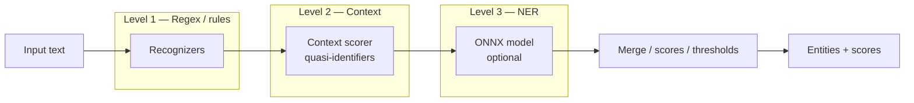
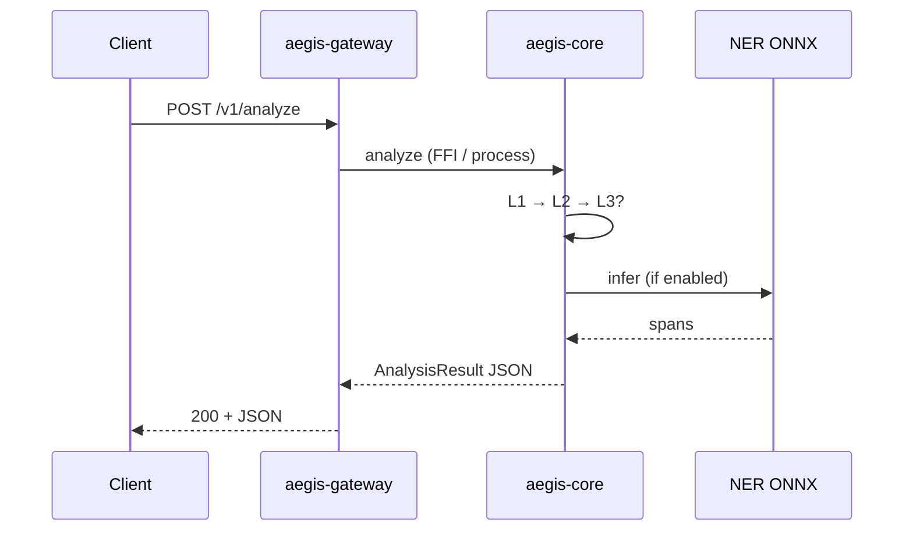

# AEGIS — zokastech.fr — Apache 2.0 / MIT

# Architecture

## High-level components

| Component | Role |
|-----------|------|
| **aegis-gateway** (Go) | HTTP API, optional RBAC, audit sink, policy hooks |
| **aegis-core** (Rust) | Analyzer engine: registry + 3-level pipeline |
| **aegis-regex** (Rust) | Level-1 recognizers (regex, validators, lexicons) |
| **aegis-ner** (Rust) | Level-3 ONNX NER backend (optional) |
| **aegis-anonymize** (Rust) | Anonymization operators (redact, mask, FPE, …) |
| **aegis-policy** (Go) | YAML policy packs (GDPR-oriented) |
| **aegis-dashboard** (React) | Admin / playground UI (maturity varies) |
| **PostgreSQL / Redis** | Persistence & cache (typical deployment) |

## Three-level detection pipeline

- **L1**: Fast pattern-based detectors (email, phone, IBAN, …).
- **L2**: Contextual boosts/penalties (e.g. “patient”, “Mr.”) and combination rules.
- **L3**: Machine-learning NER when configured (`ner.model_path`) and invoked according to pipeline thresholds and timeouts.

Levels are selected with `pipeline_level` and the detailed `pipeline` block in [`aegis-config.yaml`](configuration.md).

## Data flow (request path)

Personal data **flows through the gateway and engine** for each analyze/anonymize call. **Do not log raw request bodies** in production unless your DPA allows it.

## Related documentation

- [Threat model](security/threat-model.md) — STRIDE & data-flow for DPOs
- [Deployment](deployment.md) — networks and secrets
