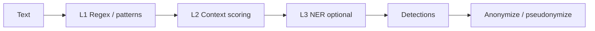

<section class="zok-hero">

Zokastech · Open source · EU-first

AEGIS

PII detection &amp; anonymization for text — Rust, Go, and HTTP APIs

<em>Aegis</em> (Greek αἰγίς): the shield of Athena — protection by design. AEGIS helps teams <strong>identify</strong> and <strong>de-identify</strong> personal data in free text with transparent, auditable pipelines.

<a class="zok-btn zok-btn--light" href="getting-started/">Get started</a>
<a class="zok-btn zok-btn--ghost" href="https://github.com/zokastech/aegis" rel="noopener noreferrer" target="_blank">GitHub</a>
<a class="zok-btn zok-btn--ghost" href="https://zokastech.fr" rel="noopener noreferrer" target="_blank">zokastech.fr</a>

</section>

## Goals

- **Democratize** strong PII controls for European and global teams: open codebase, dual license **Apache 2.0 / MIT**, self-hosted by default.
- **Embrace extensibility**: custom recognizers, YAML engine config, optional ONNX NER, reversible operators (encrypt, FPE, pseudonymization).
- **Support automated and semi-automated flows**: REST gateway, CLI, SDKs (Python, Node, Java — maturity varies), and integration patterns (Kafka, Spark, dbt, CI/CD — see docs).

## How it works

High-level path from raw text to redacted or reversible output:

For depth: [Architecture](architecture.md).

## Main features

1. **Built-in and custom recognizers** — regex, checksums, EU-oriented packs, context lexicons, and optional **token-classification (ONNX)**.
2. **Policy-driven anonymization** — redact, mask, hash, replace, **encrypt**, **FPE**, pseudonymization; metadata for reversal where configured.
3. **Multiple runtimes** — embed via **Rust** crates, call **Go** gateway **`/v1/*`**, or use **CLI** / language SDKs.
4. **Configurable pipeline** — thresholds, levels L1–L3, decision traces for audit (use sparingly in production).
5. **Operations-friendly** — **Prometheus** metrics, security hardening guides, cloud deployment references (AWS, GCP, Azure, OVH).

!!! warning "Detection is probabilistic"
    Automated detectors **cannot guarantee** that all sensitive data is found. Combine AEGIS with **process controls**, **human review** where required, and **defense in depth**. Same caveat as other PII SDKs (e.g. [Microsoft Presidio](https://microsoft.github.io/presidio/)).

## Try AEGIS

- **Local quick path:** [Getting started](getting-started.md) (Docker / binary / dev compose).
- **Interactive UI:** [Dashboard — Playground](dashboard-playground.md) (confidence slider, pipeline levels).
- **Why choose AEGIS:** [Why AEGIS — competitive landscape](why-aegis.md).

## AEGIS components

**[Core engine](architecture.md)**  

Pipeline orchestration, entity types, `AnalyzerEngine` (Rust).

**[Recognizers](recognizers.md)**  

Regex & EU packs: IBAN, phones, national IDs, GDPR-flavored signals, and more.

**[Anonymization](anonymization.md)**  

`AnonymizerEngine`, operators, reversible metadata patterns.

**[HTTP gateway](api-reference.md)**  

Go service: `/v1/analyze`, `/v1/anonymize`, policies, metrics.

**[Dashboard](dashboard-playground.md)**  

React playground for thresholds, anonymization preview, observability links.

**[SDKs & examples](examples.md)**  

Python, Node, Java JNI, notebooks, and service samples.

## Installing AEGIS

- [Install & first run](getting-started.md)
- [`aegis-config.yaml`](configuration.md)
- [Production deployment](deployment.md)
- [Build from source](contributing.md)

## Running AEGIS

- [Code & notebook samples](examples.md)
- [REST API reference](api-reference.md)
- [CI/CD patterns](cicd.md)
- [Prometheus & Grafana](monitoring-prometheus-grafana.md)

## Languages

Documentation is published in **English** (default), **French**, **German**, **Spanish**, and **Italian** via the language selector. Untranslated pages **fall back to English**.

## Support

- **Usage / bugs / ideas:** [GitHub Issues](https://github.com/zokastech/aegis/issues) for the open-source repository.
- **Security:** follow the project security policy (see repository **SECURITY**).
- **Zokastech** (product, partnerships, press): [info@zokas.tech](mailto:info@zokas.tech)

## License & brand

Dual-licensed **Apache 2.0** and **MIT** — see the repository `LICENSE`. Visual identity for Zokastech-aligned surfaces: [Brand guidelines](brand-guidelines.md).

Docs layout inspired by the clarity of <a href="https://microsoft.github.io/presidio/">Microsoft Presidio</a>’s home page; AEGIS is an independent project by Zokastech.

