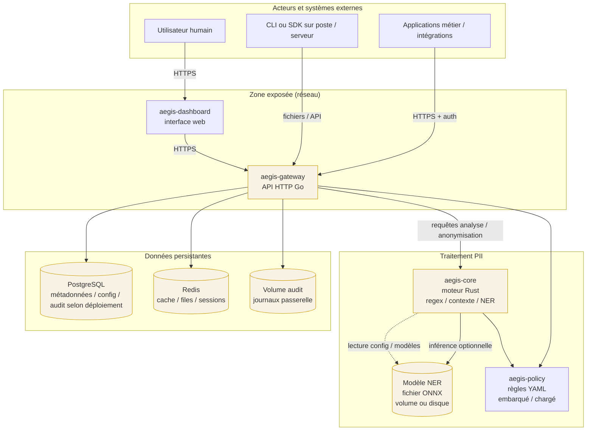

# AEGIS — zokastech.fr — Apache 2.0 / MIT

## Modèle de menaces (STRIDE)

Ce document décrit les principaux risques de sécurité et de confidentialité autour de **AEGIS** (détection et traitement de données à caractère personnel) pour les équipes juridiques et les **DPO** (délégués à la protection des données). Les termes techniques sont brièvement expliqués en marge.

| Terme | Explication courte |
|--------|-------------------|
| **PII / données personnelles** | Toute information permettant d’identifier une personne (nom, e-mail, numéro, texte libre, etc.). |
| **API** | Point d’entrée logiciel par lequel un système envoie du texte à analyser ou anonymiser. |
| **TLS / HTTPS** | Chiffrement des échanges sur le réseau (empêche la lecture simple du contenu en transit). |
| **NER** | Détection d’entités nommées (ex. personnes, lieux) par modèle automatique ; plus coûteux en ressources que les simples règles textuelles. |

**Périmètre** : déploiement type « stack complète » (passerelle HTTP, moteur Rust, base de données, cache, tableau de bord), tel que décrit dans le dépôt (Docker / Kubernetes). Les intégrations embarquées (SDK, CLI hors serveur) partagent des menaces analogues côté « client ».

---

## 1. Diagramme de flux de données

Le schéma suivant résume **qui envoie quoi** et **où transitent les données personnelles** lorsqu’AEGIS est utilisé comme service.

**Lecture pour le DPO** : toute donnée textuelle envoyée à la passerelle ou au moteur peut contenir des **données personnelles**. Les bases PostgreSQL et Redis, ainsi que les journaux d’audit, peuvent contenir des **traces** (métadonnées, identifiants de requête, extraits selon configuration). Le modèle NER est un **fichier** : son intégrité influence la qualité du traitement mais ne contient en principe pas les textes des utilisateurs.

---

## 2. Analyse STRIDE par composant

La méthode **STRIDE** classe les menaces en six familles :

| Famille | Question que l’on se pose |
|---------|---------------------------|
| **S**poofing | Un acteur peut-il se faire passer pour un autre ? |
| **T**ampering | Peut-on modifier données ou logiciels sans être détecté ? |
| **R**epudiation | Un acteur peut-il nier avoir effectué une action ? |
| **I**nformation disclosure | Des données sensibles peuvent-elles fuiter ? |
| **D**enial of service | Peut-on rendre le service indisponible ou trop lent ? |
| **E**levation of privilege | Peut-on accéder à des fonctions ou données non autorisées ? |

Pour chaque composant principal, les menaces les plus pertinentes sont listées avec des **mesures d’atténuation** (voir section 3 pour une synthèse).

### 2.1 Passerelle API (`aegis-gateway`)

| STRIDE | Menace | Pourquoi c’est sensible |
|--------|--------|-------------------------|
| **Spoofing** | Usurpation d’identité sur l’API (client fictif, clé API volée, session volée). | Un attaquant envoie des requêtes au nom d’un client légitime et consomme le service ou accède à des fonctions réservées. |
| **Tampering** | Modification des requêtes ou réponses en transit ; altération des journaux d’audit. | Falsification du texte analysé ou des résultats ; effacement de traces. |
| **Repudiation** | Déni d’avoir appelé l’API ou d’avoir traité tel contenu. | Difficulté pour la conformité et les investigations internes. |
| **Information disclosure** | Fuite de PII via réponses API, messages d’erreur verbeux, ou logs contenant le corps des requêtes. | Violation de confidentialité ; problème RGPD. |
| **Denial of service** | Surcharge HTTP, très gros fichiers, rafales de requêtes. | Indisponibilité pour tous les utilisateurs. |
| **Elevation of privilege** | Contournement de l’authentification, accès à des routes admin ou à la **dé-anonymisation** (clés FPE / jetons réversibles) sans droit. | Retrait de l’anonymisation ou accès à des données protégées. |

### 2.2 Moteur d’analyse (`aegis-core`, pipeline L1 / L2 / L3)

| STRIDE | Menace | Pourquoi c’est sensible |
|--------|--------|-------------------------|
| **Spoofing** | Peu direct ; l’identité est surtout établie à la passerelle. | Si le moteur est exposé sans passerelle, même risque que pour l’API. |
| **Tampering** | Modification de la configuration (`aegis-config.yaml`), du binaire ou du modèle ONNX. | Comportement imprévisible : faux négatifs (PII non détectée) ou faux positifs. |
| **Repudiation** | Traitements sans corrélation avec un identifiant de requête côté passerelle. | Traçabilité affaiblie si les journaux ne sont pas alignés. |
| **Information disclosure** | Fuite via traces de décision, dumps mémoire, ou journalisation du texte entier. | Exposition de PII dans les journaux ou dumps. |
| **Denial of service** | **Surcharge du moteur NER** (textes énormes, requêtes concurrentes massives, absence de timeouts). | CPU / mémoire saturés ; latence excessive. |
| **Elevation of privilege** | Désactivation de contrôles par mauvaise config (chemins de fichiers, options debug). | Traitement hors politique métier. |

### 2.3 Modèle NER (ONNX) et stockage

| STRIDE | Menace | Pourquoi c’est sensible |
|--------|--------|-------------------------|
| **Spoofing** | Substitution du fichier modèle par une version malveillante (si l’attaquant écrit sur le volume). | Résultats biaisés ou fuite indirecte via comportement du modèle. |
| **Tampering** | Altération du modèle ou du checksum non détectée. | Perte d’intégrité des analyses. |
| **Repudiation** | N/A en tant que tel. | — |
| **Information disclosure** | Le modèle ne contient en principe pas les données utilisateurs ; risque indirect si des artefacts sont mal stockés à côté. | Confusion avec des jeux de données d’entraînement mal placés. |
| **Denial of service** | Modèle trop lourd ou inférence non bornée. | Ralentit tout le pipeline. |
| **Elevation of privilege** | N/A direct. | — |

### 2.4 PostgreSQL et Redis

| STRIDE | Menace | Pourquoi c’est sensible |
|--------|--------|-------------------------|
| **Spoofing** | Connexion à la base avec identifiants volés. | Accès aux tables (politiques, utilisateurs, audit, etc.). |
| **Tampering** | Modification ou suppression d’enregistrements d’audit ou de configuration. | Perte de preuve ; altération des règles. |
| **Repudiation** | Absence d’audit base ou journaux non protégés en écriture. | Impossible de prouver qui a changé quoi. |
| **Information disclosure** | Sauvegardes non chiffrées, exposition réseau de la base, requêtes SQL injectées via l’application. | Fuite massive de métadonnées ou de contenus stockés. |
| **Denial of service** | Requêtes lourdes, remplissage du disque, saturation Redis. | Panne de la passerelle ou perte de cache/sessions. |
| **Elevation of privilege** | Compte applicatif avec trop de droits (superuser). | Accès à toutes les données. |

### 2.5 Tableau de bord (`aegis-dashboard`)

| STRIDE | Menace | Pourquoi c’est sensible |
|--------|--------|-------------------------|
| **Spoofing** | Session utilisateur volée (cookie), pas de re-auth sur actions sensibles. | Accès à l’UI au nom d’un administrateur. |
| **Tampering** | Modification du JavaScript servi (MITM si pas de TLS). | Redirection des actions vers un site malveillant. |
| **Repudiation** | Actions UI non tracées côté serveur. | Même logique que pour l’API. |
| **Information disclosure** | Affichage de PII dans le navigateur (playground) capturé par une extension ou un poste partagé. | Fuite « côté client ». |
| **Denial of service** | Charge anormale via l’UI. | Impact généralement moindre que sur l’API si l’UI est derrière la même passerelle. |
| **Elevation of privilege** | Accès à des écrans d’admin sans contrôle de rôle. | Même famille que pour la passerelle. |

### 2.6 Clients distants (CLI, SDK, applications métier)

| STRIDE | Menace | Pourquoi c’est sensible |
|--------|--------|-------------------------|
| **Spoofing / Tampering / …** | Même modèle que pour l’API, plus vol de **secrets** (clés) sur le poste ou dans le pipeline CI. | Les clés permettent souvent l’accès complet au service. |

---

## 3. Mitigations (synthèse par famille de menace)

Les mesures ci-dessous sont **recommandations** ; leur mise en œuvre dépend de votre hébergement (cloud, interne, Kubernetes, etc.). Elles complètent le guide opérationnel [`hardening.md`](hardening.md).

### Spoofing (usurpation sur l’API)

- Exiger **TLS** partout (pas de HTTP en clair en production).
- **Authentification forte** : clés API rotatives, OAuth2 / mTLS pour les intégrations sensibles, pas de secrets dans les URL.
- **Répartition des rôles** : comptes de service distincts par application ; principe du moindre privilège.

### Tampering (données en transit ou au repos)

- **TLS** avec versions et cipher suites à jour ; idéalement **mTLS** entre services sur le réseau interne.
- **Intégrité des images** et des binaires (signatures, SBOM, provenance — voir `SECURITY.md`).
- **Contrôle d’accès** aux volumes (modèles ONNX, configuration) en lecture seule pour le processus moteur.
- Sauvegardes **chiffrées** et **contrôlées** ; journalisation des accès administration base de données.

### Repudiation (d’où l’intérêt du journal d’audit)

- Activer et **centraliser** les journaux d’audit (passerelle, reverse proxy, base si pertinent) avec **horodatage** fiable.
- Associer chaque opération sensible à un **identifiant de corrélation** (trace ID) et, si possible, à l’identité du client.
- **Protéger les journaux** en écriture (append-only, SIEM) pour limiter l’effacement discret.

### Information disclosure (fuite de PII via le service)

- **Ne pas logger** le corps brut des requêtes contenant du texte libre en production ; masquer ou échantillonner selon la politique interne.
- Réponses d’erreur **génériques** côté client ; détails techniques réservés aux journaux côté serveur avec contrôle d’accès.
- **Minimisation** : ne renvoyer au client que les champs nécessaires ; durée de rétention limitée pour tout stockage de texte.
- **Playground / dashboard** : usage réservé aux environnements sécurisés ; sensibilisation des utilisateurs (poste personnel, captures d’écran).

### Denial of service (dont surcharge NER)

- **Limites de taille** de corps, timeouts sur chaque étape du pipeline (déjà paramétrables dans la config moteur).
- **Rate limiting** et quotas à la passerelle / WAF / API gateway en amont.
- **Autoscaling** ou files d’attente pour absorber les pics ; surveillance CPU / mémoire du conteneur moteur.
- Désactiver ou limiter le niveau NER (pipeline) si le risque de saturation prime sur le rappel.

### Elevation of privilege (dont dé-anonymisation non autorisée)

- Séparer **strictement** les opérations « anonymiser / pseudonymiser » et toute opération **réversible** (FPE, tables de tokenisation) : clés dans un **gestionnaire de secrets**, rotation, accès réservé à un rôle admin.
- **Politiques** (package `aegis-policy`) versionnées et déployées comme configuration contrôlée ; pas de modification ad hoc en production sans revue.
- Revue de code et **tests** sur les chemins « admin » et « re-identification ».

---

## 4. Risques résiduels

Même avec de bonnes pratiques, certains risques **ne peuvent pas être réduits à zéro** :

| Risque résiduel | Description |
|-----------------|-------------|
| **Erreur humaine** | Mauvaise configuration (TLS désactivé, logs trop verbeux, mot de passe par défaut). |
| **Compromission du poste client** | Malware ou extension navigateur lisant le texte saisi dans le dashboard ou les réponses API. |
| **Fournisseur / hébergeur** | Accès administrateur de la plateforme cloud ; modèle de responsabilité partagée. |
| **Modèle NER imparfait** | Faux négatifs : PII non détectée malgré le traitement — risque **conformité**, pas seulement sécurité. |
| **Chaîne d’approvisionnement** | Vulnérabilité dans une dépendance ou une image ; atténuation par scans et mises à jour, pas élimination totale. |

Ces points doivent figurer dans l’**analyse d’impact** (AIPD / DPIA) lorsque le traitement présente un risque élevé pour les personnes.

---

## 5. Matrice de risques (probabilité × impact)

Échelle volontairement **qualitative** pour faciliter l’échange avec le juridique. « Impact » inclut à la fois **atteinte aux personnes** (données personnelles) et **impact opérationnel**.

**Probabilité** : *Faible* (peu plausible dans un déploiement durci) · *Moyenne* · *Élevée* (scénarios fréquents ou faciles).

**Impact** : *Faible* · *Moyen* · *Élevé* · *Critique* (violation massive, arrêt prolongé, atteinte grave aux droits).

| Scénario (synthèse) | Probabilité | Impact | Niveau combiné | Commentaire |
|---------------------|-------------|--------|----------------|-------------|
| Usurpation d’identité API (clé volée) | Moyenne | Élevé | **Élevé** | Mitigation : rotation, scopes, monitoring. |
| PII dans les logs applicatifs | Moyenne | Élevé | **Élevé** | Mitigation : politique de logs, revues régulières. |
| DoS par surcharge NER / gros textes | Moyenne | Moyen à élevé | **Élevé** | Mitigation : limites, timeouts, scale-out. |
| Accès non autorisé à la dé-anonymisation | Faible | Critique | **Élevé** | Mitigation : secrets manager, RBAC, séparation des environnements. |
| Fuite par erreur de configuration TLS | Faible | Élevé | **Moyen** | Mitigation : checks automatisés, hardening. |
| Remplacement malveillant du modèle ONNX | Faible | Moyen | **Moyen** | Mitigation : images immuables, contrôle d’accès au stockage. |
| Indisponibilité Redis / Postgres | Moyenne | Moyen | **Moyen** | Mitigation : HA, sauvegardes, healthchecks. |
| Faux négatifs NER (PII non détectée) | Élevée | Variable | **À traiter en conformité** | Plutôt risque de **qualité / conformité** ; recours à la couche L1/L2 et revue métier. |

> **Lecture DPO** : les cases **Élevé** justifient des mesures organisationnelles (procédures, contrats, clauses DPIA) en plus des mesures techniques. Le dernier scénario rappelle qu’AEGIS est un **outil d’aide** : la responsabilité du responsable de traitement reste engagée sur l’exactitude et la finalité du traitement.

---

## 6. Suivi du document

| Version | Date | Changement |
|---------|------|------------|
| 1.0 | 2026-04 | Création initiale — alignement sur l’architecture monorepo AEGIS (zokastech.fr). |

Pour toute vulnérabilité de sécurité, voir le fichier [`SECURITY.md` sur GitHub](https://github.com/zokastech/aegis/blob/main/SECURITY.md).
