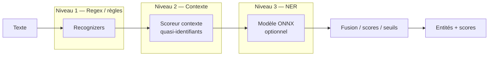
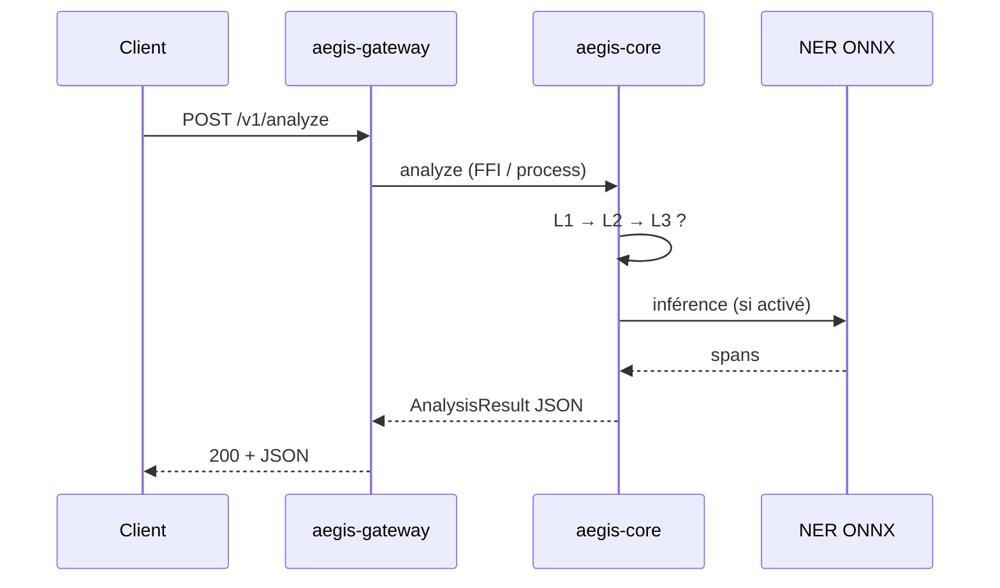

# AEGIS — zokastech.fr — Apache 2.0 / MIT

# Architecture

## Composants (vue d’ensemble)

| Composant | Rôle |
|-----------|------|
| **aegis-gateway** (Go) | API HTTP, RBAC optionnel, réceptacle d’audit, hooks politiques |
| **aegis-core** (Rust) | Moteur d’analyse : registre + pipeline à 3 niveaux |
| **aegis-regex** (Rust) | Recognizers niveau 1 (regex, validateurs, lexiques) |
| **aegis-ner** (Rust) | Backend NER ONNX niveau 3 (optionnel) |
| **aegis-anonymize** (Rust) | Opérateurs d’anonymisation (redact, mask, FPE, …) |
| **aegis-policy** (Go) | Paquets de politiques YAML (orientés RGPD) |
| **aegis-dashboard** (React) | UI admin / playground (maturité variable) |
| **PostgreSQL / Redis** | Persistance et cache (déploiement type) |

## Pipeline de détection à trois niveaux

- **L1** : détecteurs rapides par motifs (e-mail, téléphone, IBAN, …).
- **L2** : bonus / pénalités contextuels (ex. « patient », « M. ») et règles de combinaison.
- **L3** : NER ML lorsque configuré (`ner.model_path`) et invoqué selon seuils et timeouts du pipeline.

Les niveaux se choisissent avec `pipeline_level` et le bloc détaillé `pipeline` dans [`aegis-config.yaml`](configuration.md).

## Flux de données (chemin requête)

Les données personnelles **transitent par la passerelle et le moteur** à chaque appel analyze/anonymize. **Ne pas journaliser les corps de requête bruts** en production sauf cadre DPA explicite.

## Documentation associée

- [Modèle de menaces](security/threat-model.md) — STRIDE et flux de données pour les DPO
- [Déploiement](deployment.md) — réseaux et secrets
