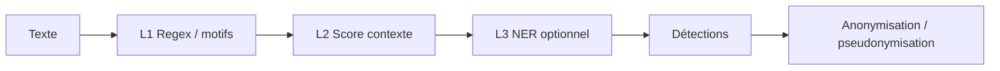

<section class="zok-hero">

Zokastech · Open source · EU-first

AEGIS

Détection &amp; anonymisation des données personnelles dans le texte — Rust, Go et API HTTP

<em>Aegis</em> (grec αἰγίς) : le bouclier d’Athéna — protection par conception. AEGIS aide les équipes à <strong>identifier</strong> et à <strong>désidentifier</strong> les données personnelles dans du texte libre, avec des pipelines transparents et auditable.

<a class="zok-btn zok-btn--light" href="getting-started/">Démarrer</a>
<a class="zok-btn zok-btn--ghost" href="https://github.com/zokastech/aegis" rel="noopener noreferrer" target="_blank">GitHub</a>
<a class="zok-btn zok-btn--ghost" href="https://zokastech.fr" rel="noopener noreferrer" target="_blank">zokastech.fr</a>

</section>

## Objectifs

- **Démocratiser** des contrôles PII solides pour les équipes européennes et au-delà : code ouvert, double licence **Apache 2.0 / MIT**, auto-hébergé par défaut.
- **Favoriser l’extensibilité** : recognizers personnalisés, configuration moteur YAML, NER ONNX optionnel, opérateurs réversibles (chiffrement, FPE, pseudonymisation).
- **Couvrir les flux automatisés et semi-automatisés** : passerelle REST, CLI, SDK (Python, Node, Java — maturité variable) et patterns d’intégration (Kafka, Spark, dbt, CI/CD — voir la doc).

## Fonctionnement

Chemin simplifié du texte brut vers une sortie masquée ou réversible :

Pour le détail : [Architecture](architecture.md).

## Fonctionnalités principales

1. **Recognizers intégrés et personnalisés** — regex, contrôles de clé, packs EU, lexiques de contexte et **classification de tokens (ONNX)** optionnelle.
2. **Anonymisation pilotée par politique** — redaction, masquage, hachage, remplacement, **chiffrement**, **FPE**, pseudonymisation ; métadonnées de réversibilité lorsque configuré.
3. **Plusieurs modes d’exécution** — embarqué via crates **Rust**, passerelle **Go** **`/v1/*`**, ou **CLI** / SDK langage.
4. **Pipeline configurable** — seuils, niveaux L1–L3, traces de décision pour l’audit (à utiliser avec parcimonie en production).
5. **Exploitation** — métriques **Prometheus**, guides de durcissement, références de déploiement cloud (AWS, GCP, Azure, OVH).

!!! warning "Détection probabiliste"
    Les détecteurs automatiques **ne garantissent pas** la découverte de toutes les données sensibles. Combinez AEGIS avec des **contrôles de processus**, une **revue humaine** lorsque nécessaire et une **défense en profondeur**. Même limite que les autres SDK PII (ex. [Microsoft Presidio](https://microsoft.github.io/presidio/)).

## Essayer AEGIS

- **Démarrage local :** [Démarrage](getting-started.md) (Docker / binaire / compose dev).
- **Interface interactive :** [Dashboard — Playground](dashboard-playground.md) (curseur de confiance, niveaux de pipeline).
- **Pourquoi AEGIS :** [Pourquoi AEGIS — paysage concurrentiel](why-aegis.md).

## Composants AEGIS

**[Moteur core](architecture.md)**  

Orchestration du pipeline, types d’entités, `AnalyzerEngine` (Rust).

**[Recognizers](recognizers.md)**  

Regex & packs EU : IBAN, téléphones, identités nationales, signaux RGPD, etc.

**[Anonymisation](anonymization.md)**  

`AnonymizerEngine`, opérateurs, schémas de métadonnées réversibles.

**[Passerelle HTTP](api-reference.md)**  

Service Go : `/v1/analyze`, `/v1/anonymize`, politiques, métriques.

**[Dashboard](dashboard-playground.md)**  

Playground React : seuils, aperçu d’anonymisation, liens d’observabilité.

**[SDK & exemples](examples.md)**  

Python, Node, JNI Java, notebooks et exemples de services.

## Installer AEGIS

- [Installation & premier lancement](getting-started.md)
- [`aegis-config.yaml`](configuration.md)
- [Déploiement production](deployment.md)
- [Compiler depuis les sources](contributing.md)

## Exécuter AEGIS

- [Exemples code & notebooks](examples.md)
- [Référence API REST](api-reference.md)
- [CI/CD](cicd.md)
- [Prometheus & Grafana](monitoring-prometheus-grafana.md)

## Langues

Ce site est disponible en **anglais** (par défaut), **français**, **allemand**, **espagnol** et **italien**. Les pages sans traduction **repassent sur l’anglais**.

## Contribuer aux traductions

Les pages françaises sont sous `docs/fr/` avec la même arborescence que `docs/en/`. Pour le workflow du dépôt : [Contribuer](contributing.md).

## Support

- **Usage / bugs / idées :** [GitHub Issues](https://github.com/zokastech/aegis/issues) du dépôt open source.
- **Sécurité :** suivre la politique du dépôt (**SECURITY**).
- **Zokastech** (produit, partenariats, presse) : [info@zokas.tech](mailto:info@zokas.tech)

## Licence & charte

Double licence **Apache 2.0** et **MIT** — voir `LICENSE` sur le dépôt. Identité visuelle Zokastech : [Charte graphique](brand-guidelines.md).

Structure de page inspirée de la clarté de l’accueil <a href="https://microsoft.github.io/presidio/">Microsoft Presidio</a> ; AEGIS est un projet indépendant porté par Zokastech.

